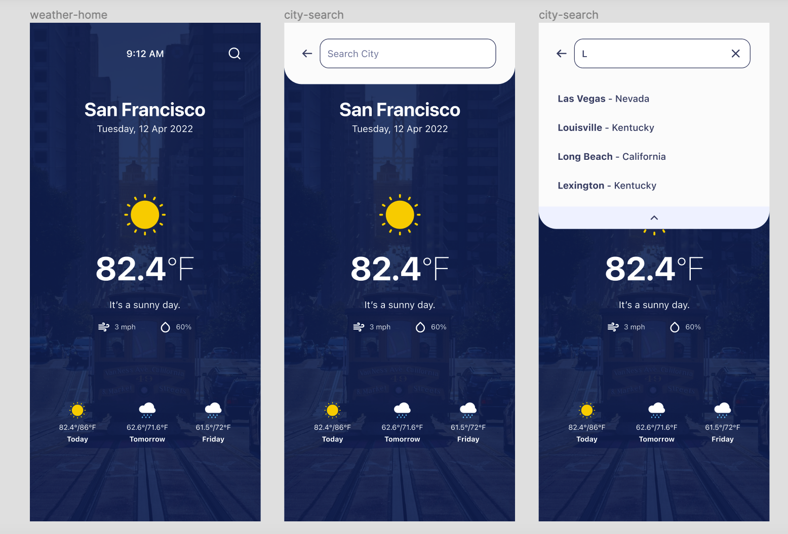

Coding Challenge

General requirements:
• Implement using Kotlin
• Be sure to follow the designs, submissions not matching the designs will not be evaluated

Sample app:
• Create a 3 days weather forecast app with free weather API
◦ https://www.weatherapi.com
• Follow the Figma design linked here
• Special Notes:
◦ icons returned from API are low resolution and will appear pixelated in your submission, this is OK
◦ The background image is static and does not change based on what location is selected by the user
◦ The two sub items for ‘today’ are wind_mph and humidity

 